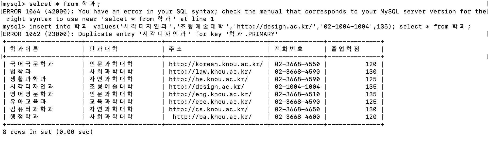

# 데이터 조작 
## ✅insert문
    테이블에 새로운 레코드를 삽입(추가)하고자 할 때 사용하는 DML이다. 
    insert문으로 레코드를 삽입할 때 테이블 내에 있는 모든 컬럼값을 입력하거나 일부의 컬럼만 선택적으로 입력할 수 있다.
    이때 컬럼이 널(NULL)값을 허용하지 않는 not null컬럼에 대해서는 반드시 데이터 값을 입력해야하며, 
    지정한 컬럼 개수와 대응되는 입력값의 개수 및 데이터 타입이 일치해야한다.
    
-insert문의 형식은 다음과 같다.
    
    insert into 테이블 이름
        values (V1,V2 ....Vn)

문제: 학과 테이블에 학과이름 '시각디자인과', 단과대학 '자연예술대학', 주소'hppt://naver.com', 전화번호'02-1004-1004', 졸업학점 135인 레코드를 삽입하라.

내가 친 코드: 

    insert into 학과
    values ('시각디자인과','자연예술대학','http://naver.com','02-1004-1004');
            select * from 학과;

결과:

잘 들어갔음을 확인할 수 있다.

## ✅update문
    insert문 등을 통해 테이블에 지정된 레코드에 대한 컬럼값을 변경하기 위해서는 update문을 사용한다.
    update문에서는 set절과 함께 컬럼과 변경하려고 하는 값을 명시한다. 
    일부 레코드에 대해서만 값을 변경하고자 하는 경우에는 where절을 사용한다.

-update문의 형식은 다음과 같다.
    
    update 테이블이름
        set컬럼1= 값1[,컬럼2=값2.....]
        [where 조건]

문제: 학과 테이블에서 학과 이름이 '시각디자인과'인 레코드의 주소 컬럼의 값을 'http://test.test'으로 수정하라.

내가 친 코드:
    
    update 학과 set 주소='http://test.com' where 학과이름='시각디자인과'; select * from 학과;

결과:

잘 들어갔다.

## ✅delete문

## ✅select문

(1)Select 절
select절은 질의 결과에 포함되는 컬럼을 지정

(2)from절
질의를 적용할 테이블을 지정

(3)on절
조인 연산 시 테이블간의 조인 방법을 기술

(4)where절
레코드에 대한 특정 검색 조건을 기술할 때 사용

(5)group by절
특정 컬럼을 기준으로 동일한 값끼리 그룹으로 묶어 요약된 결과를 검색할 수 있게 한다.

(6)having절
group by에 묶인 그룹 내에서 조건을 주어 검색하고자 할때 사용하는 절

(7)order by절
검색결과를 특정 컬럼을 기준으로 asc, desc, 키워드를 사용하여 오름차순,내림차순으로 정렬하여 출력할 때 사용한다.

**1)단순 질의문**
가장 기본적이고 단순한 select문은 select, from 2개절의 구조를 갖는 단순 검색이다.

    Select 컬럼1, 컬럼2 from 테이블

문제: 교수테이블에서 ’소속학과’컬럼을 선택하여 출력

	select 소속학과 from 교수;

*만약 검색의 결과에 중복을 허용하고 싶지 않다면 select절에서 소속컬럼 앞에 distinct키워드를 추가하면 중복되는 레코드를 제거하여 출력할 수 있다.

	select distinct 소속학과 from 교수;

**2)조건질의문**
대상 테이블에서 조건을 만족하는 일부 레코드만 선택적으로 검색할 때 사용하는 select문이다. 구문 형식은 다음과 같다.

    Select 컬럼1,컬럼2 from 테이블 where 검색조건

문제:이수구분이 ‘전공필수’인 과목의 과목명, 학점, 선수과목을 출력하라.
-이 질의문에서의 레코드에 대한 조건은 이수구분의 컬럼값이 ‘전공필수’와 일치해야하는 비교 연산을 요구한다. 이러한 검색을 일치 검색이라고 하며, 일치 검색을 위해 비교 연산자인 ‘=‘연산자가 사용된다. 비교 연산자는 컬럼 값과 상수 값 또는 컬럼값과 다른 컬럼값을 비교하는 연산자를 의미한다.

    